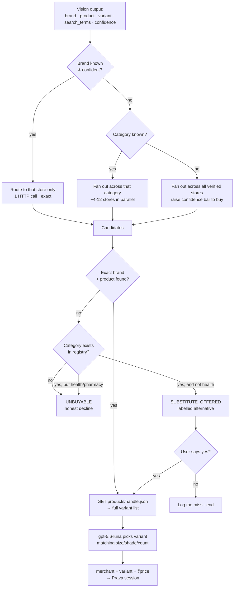
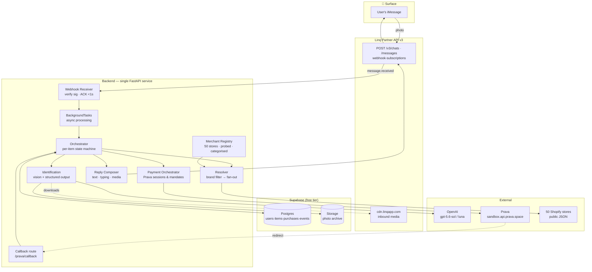
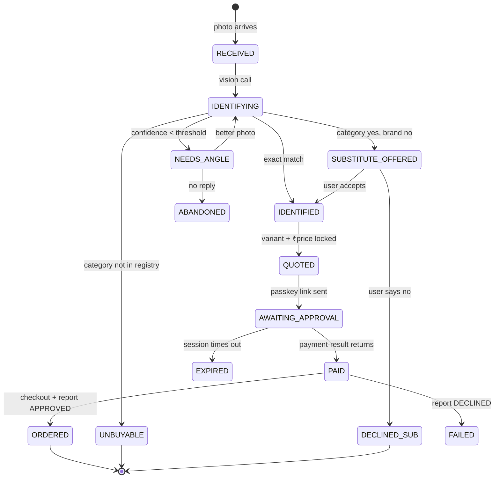
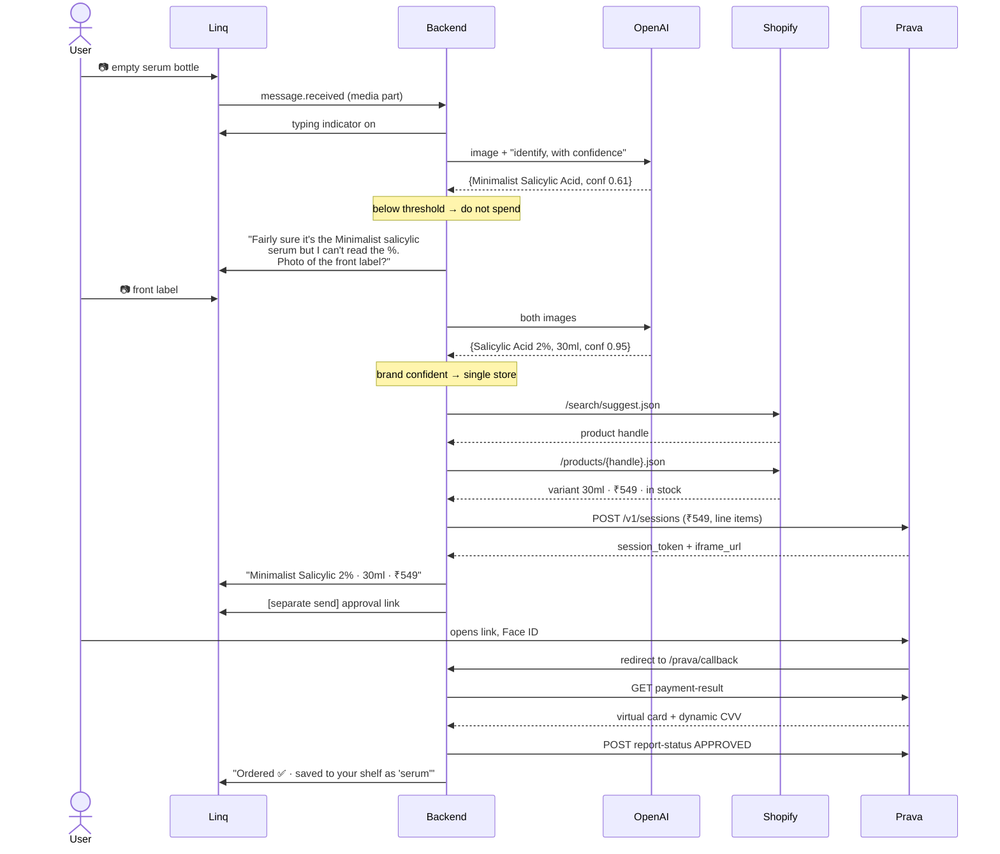

# Otto — Architecture & Design (v5, Python)

*Photograph a thing. Get another one. Solo build, ~20h, iMessage + Prava + OpenAI.*

**The name.** *Otto* is a palindrome — it reads the same in both directions, which is the product. It also sounds like "auto" without ever saying it. Short, warm, easy to say out loud in a demo.

> **Changed in v5:** renamed from Same Again to Otto.
> **v4:** brand substitution as a fourth outcome — labelled, consent-gated, blocked in health categories.
> **v3:** full 50-merchant registry with auto-probing (replaces the hand-picked three) · brand-as-hard-filter guardrail · complete sources & references appendix.
> **v2:** Python stack · Shopify resolution pipeline · hosted-mode payments.

---

## 0. Read this first — the finding that shapes everything

The Prava REST API reference has a trap that will cost you six hours if you find it at 2am.

**The Prava sandbox does not include product search or checkout execution.**

The REST/SDK path — the *only* path with a sandbox — is exactly four steps:

1. `POST /v1/sessions` — you declare merchant, amount, line items
2. Cardholder enters card + approves with passkey on Prava's hosted page *(no API call)*
3. `GET /v1/sessions/{id}/payment-result` — returns a **virtual card number + dynamic CVV**
4. `POST /v1/sessions/{id}/report-status` — you report `APPROVED` / `DECLINED`

The `shop_search → shop_product → shop_quote → shop_checkout` chain and the Browser Harness that drives a real merchant checkout exist **only on the Prava Pay CLI**, which is **production-only** and requires manual human approval.

So two things are yours to solve: **discovery** and **checkout execution**. §1, §3 and §7 handle them.

---

## 1. The merchant universe — all 50, not three

**Source: [Prava Merchant List (Google Sheet)](https://docs.google.com/spreadsheets/d/1Vwqybz1P9pNz3aQXc8Q4uVqa1p7vYTu_y3ySC7Xsunw/edit?gid=890707389#gid=890707389)**

The sheet's `INDIA` tab lists **50 Shopify merchants with published UCP endpoints**, all following:

```
https://{store}.myshopify.com/api/ucp/mcp
```

These beat the US merchants named in Prava's docs on every axis: prices in ₹, endpoints explicitly published, and categories dominated by **repeat-purchase consumables** — exactly this product's thesis.

### Don't hand-pick. Probe all of them.

There is no meaningful engineering cost difference between 3 merchants and 50 when the integration is "GET a JSON URL." Fan-out across 50 stores with `httpx.AsyncClient` is a few hundred milliseconds. So load the whole sheet and let a script tell you which stores actually answer:

```python
# probe_merchants.py — run once, in hour one
import asyncio, csv, httpx

async def probe(client, domain):
    for host in (domain, f"{domain}"):          # also try the .myshopify handle
        try:
            r = await client.get(
                f"https://{host}/search/suggest.json",
                params={"q": "serum", "resources[type]": "product"},
                timeout=8, follow_redirects=True,
            )
            if r.status_code == 200 and "resources" in r.text:
                return {"domain": host, "ok": True, "status": 200}
        except Exception as e:
            last = type(e).__name__
    return {"domain": domain, "ok": False, "status": last}

async def main(rows):
    async with httpx.AsyncClient(headers={"User-Agent": "otto/1.0"}) as c:
        results = await asyncio.gather(*[probe(c, r["Domain"]) for r in rows])
    verified = [r for r in results if r["ok"]]
    print(f"{len(verified)}/{len(results)} merchants respond")
    return verified
```

Run it over every domain in the sheet, keep the 200s, write the survivors to `merchants.csv` with their `Category` column intact. That's your registry — **verified data, not three names picked by eye.** "50 merchants, auto-verified" also reads far better in the submission than "we picked three."

Try both the custom domain (`beminimalist.co`) and the `.myshopify.com` handle (`minimalistinc.myshopify.com`) — some stores answer on one but not the other.

### Category map (from the sheet)

| Category | Merchants |
|---|---|
| **Skin care** (12) | Minimalist, Dot & Key, Mamaearth, TheDermaCo, Clinikally, Dr. Sheth's, Aqualogica, Pilgrim, MCaffeine, Plum Goodness, Deconstruct, Innovist |
| **Apparel / clothing** (9) | Libas, House of Rare, Nobero, XYXX, Littlebox, Peachmode, Kalkifashion, Aachho, W for Woman |
| **Consumer electronics** (6) | boAt, Noise, ACwO, Portronics, iCruze, Headphone Zone |
| **Health / pharmacy** (4) | Kapiva, OZiva, Zanducare, Himalaya Wellness |
| **Jewelry** (4) | GIVA, Kushal's, Palmonas, Salty |
| **Footwear** (3) | Neeman's, Campus Shoes, Bacca Bucci |
| **Grooming / hair / make-up** (3) | Bombay Shaving Company, Traya Health, Renee Cosmetics |
| **Other** | Supertails (pets), Mokobara (luggage), Milton (food service), The Sleep Company, Oswaal Books, Speedo, Durex, DeoDap, Adilqadri |

### Recommended demo object

**An empty Minimalist serum bottle.** The front label carries brand + active ingredient + concentration, so a clean shot yields high confidence — and a scuffed or turned-away label gives you a natural `NEEDS_ANGLE` moment to demonstrate. Buy one today so it's physically on your desk and in stock on demo day.

Good backups: a Bombay Shaving cartridge pack, a Supertails food bag, a worn Campus shoe.

---

## 2. What the product does

| # | Feature | Priority |
|---|---|---|
| 1 | Photo in → object identified (brand, product, exact variant) | **P0** |
| 2 | Confidence score gates everything — below threshold it refuses to spend | **P0** |
| 3 | Clarification loop: asks for a *specific* angle, not "try again" | **P0** |
| 4 | Product resolution across the verified merchant registry | **P0** |
| 5 | Prava session → passkey link → real payment credential | **P0** |
| 6 | Order confirmation delivered back into the thread | **P0** |
| 7 | Graceful "I can't buy that" for out-of-universe items | **P0** ← judges will test this |
| 8 | **Labelled brand substitution** — "I can't get Dove; Minimalist has a close one. Different brand. Want it?" | **P1** ← highest-value P1 |
| 9 | The Shelf — every identified item remembered, addressable by name | **P1** |
| 10 | One-word refill (`refill serum`) via a standing mandate, no new passkey | **P1** |
| 11 | Typing indicator as loading state while vision runs | **P1** |
| 12 | Deliberate over-cap decline, shown on camera | **P1** (demo-critical) |
| 13 | Voice note input (`gpt-transcribe`) | **P2** stretch |
| 14 | Shelf web view for judges | **P2** stretch |

**Cut lines:** kill 13 and 14 first, then 11. Never cut 2, 3, 7 or 12 — those four are the entire differentiation.

**Why 8 matters more than its priority suggests.** Substitution turns the dead-end into a live path, and it's where the actual business is: someone holding an empty bottle is the most valuable moment a competing brand can buy. That's category switching, and it's a stronger "what happens next" story than affiliate revenue. It comes *from* the merchant-coverage constraint rather than in spite of it.

---

## 3. Product resolution — how you actually find the thing

Prava doesn't give you this on the sandbox path. It's ~2 hours of Python.

**Identification and resolution are different problems:**

- **Identify** (vision): *what is this?* → "Minimalist Salicylic Acid 2% serum, 30ml"
- **Resolve** (search): *where do I buy exactly that, for how much?* → merchant + variant id + price

### The free endpoints that make this trivial

Every Shopify store exposes two public JSON endpoints — **no auth, no API key, and stores cannot disable them**:

```
GET https://beminimalist.co/search/suggest.json
      ?q=salicylic+acid+2%25&resources[type]=product&resources[limit]=10

GET https://beminimalist.co/products/{handle}.json
      → every variant: id, title, price, availability
```

### ⚠️ The guardrail that matters: brand is a hard filter

Fanning out across 12 skincare stores returns ~50 candidate products from a dozen brands, several of which are also "salicylic acid 2% serum." A model picking freely from that list can plausibly return the Dot & Key one when the user photographed Minimalist.

That's a **confidently wrong purchase** — far worse than "I couldn't find it," because the entire pitch is *an agent that doesn't spend your money when it isn't sure.* One wrong-brand order in front of judges undoes the thesis.

**So: if vision returns a brand with high confidence, only accept results from that brand's store.** Fan-out is what you do when the brand is *unknown*. Breadth must never override a confident brand match.

### Routing



### Substitution — the fourth outcome

When the exact brand isn't reachable but the *category* is, offer an alternative. Two rules, both non-negotiable:

**1. Never substitute silently.** The offer is explicit and requires a yes. An auto-swap is a worse trust violation than the wrong-brand bug above — and the only thing separating them is consent. Say the quiet part out loud:

> *"I can't get the Dove one — no merchant I cover stocks it. Closest I can find is the Minimalist moisturizer, ₹399, 50ml, also fragrance-free. **It's a different brand.** Want it?"*

Every recommendation engine on the internet substitutes quietly. Yours announcing it is the differentiator, and it's the same instinct as the confidence gate.

**2. Never substitute in health or pharmacy.** Your registry contains Kapiva, OZiva, Zanducare, Himalaya Wellness, Durex and Traya. Different actives and different dosages have real consequences — "close enough" is not acceptable for a medicine or a supplement. Hard-block those categories and say why:

```python
NO_SUBSTITUTE_CATEGORIES = {
    "Health/Pharmacy",
    "Health/Health Conditions & Concerns",
}
```

**The category gate stops absurdity.** Substitution only fires when the identified item's category exists in the registry — otherwise you get "I can't buy a MacBook, but here's a serum."

The matching call should justify itself, not just assert. Ask `gpt-5.6-luna` for structured output over the category's candidate list:

```python
{
  "best_match_handle": str | None,
  "similarity": float,          # 0–1; below ~0.6 → don't offer at all
  "shared_attributes": list[str],   # ["moisturizer", "fragrance-free", "50ml"]
  "differences": list[str],         # ["different brand", "has niacinamide"]
  "one_line_pitch": str             # what the user actually reads
}
```

Show `differences` in the message. An offer that names its own downsides is far more persuasive than one that doesn't — and it's the honest version of what every retailer already does.

### ⚠️ The price rule

**The amount sent to Prava must come from the Shopify JSON response, never from a model output.** A hallucinated price that becomes a real charge is the worst possible bug in a payments demo. The model picks *which variant*; the merchant tells you *what it costs*.

### If production access lands

Prava's `shop_search` queries Shopify's **global catalog across all participating merchants in a single call**, which makes your fan-out redundant. Frame the registry in your writeup as *the sandbox-path substitute for global catalog search* — that shows you understood the platform rather than worked around it.

---

## 4. High-level architecture



### Why async, and why it isn't optional

Linq expects a fast webhook ACK. Your pipeline — download image, vision call, catalog fan-out, price lookup — is **5–20 seconds**. Process inline and you get retries, duplicate messages, and a demo that sends everything twice.

Receive → validate → write to DB → return `200` → process in the background. FastAPI's `BackgroundTasks` is enough. **Do not install Redis or Celery.** You do not have time.

### State machine — this *is* the product



**Every photo lands in one of four endings. Build all four:**

| Ending | Condition | Response |
|---|---|---|
| ✅ **Buy** | Exact brand + product found | Full purchase flow |
| 🔄 **SUBSTITUTE_OFFERED** | Category exists, brand doesn't, not health | *"Can't get the Dove one. Minimalist has a close match — ₹399, 50ml, also fragrance-free. **Different brand.** Want it?"* |
| 🚫 **UNBUYABLE** | Category not in registry at all | *"That's a MacBook Pro 14". I can't buy that — Apple doesn't sell through the checkout I use."* |
| ❓ **NEEDS_ANGLE** | Confidence below threshold | *"Fairly sure that's the Minimalist salicylic serum, but I can't read the %. Photo of the front label?"* |

Nobody else will build the middle two rows. Judges will photograph something ridiculous to see what happens — a graceful "no," and a labelled "not that, but this," are the difference between surviving the live Q&A and collapsing in it.

---

## 5. User flows

### 5.1 First identification



**The link rule.** Linq rejects links in the *first* outbound message of a new chat. The Prava approval URL is a link. So the price message and the approval link **must be two separate sends.** Test this in hour one with a real Prava URL — it's the most likely thing to silently break your demo.

### 5.2 Refill — the second act

```
User:  "refill serum"
        │
        ▼
  Shelf lookup → Minimalist Salicylic 2% 30ml, bought 12 Mar, ₹549
        │
        ▼
  Active mandate? ──no──► session w/ mandate_setup ──► passkey once
        │ yes
        ▼
  POST /mandates/{id}/charge     ← no passkey · capped · merchant-scoped
        │
        ▼
  "On its way. ₹549, same as last time."
```

Two messages, no photo, no approval. **This is what makes it a product rather than a demo.** Put it in the video immediately after the first purchase so the contrast lands.

### 5.3 The decline — your best 30 seconds

```
User:  "refill serum ×20"   →  total ₹10,980
                               mandate capped at ₹1,000
        │
        ▼
  Card network refuses the charge
        │
        ▼
  "That's ₹10,980 — over the ₹1,000 cap you set.
   The card network declined it. Want to raise the cap?"
```

Say out loud in the video: *"that wasn't my code — that was the card network."* Two Visa judges are on the panel and nobody else will demo a failure on purpose.

### 5.4 The substitution

```
User:  📷 empty Dove moisturizer
        │
        ▼
  Vision → {Dove, moisturizer, 50ml, conf 0.93}
        │
        ▼
  Brand lookup → "Dove" not in registry
        │
        ▼
  Category "Beauty & Personal Care/Skin Care" IS in registry
  and is not a health category
        │
        ▼
  Fan out across 12 skincare stores → 40 candidates
  gpt-5.6-luna ranks by function, not name
        │
        ▼
  "I can't get the Dove one — none of my merchants stock it.
   Closest is Minimalist's moisturizer: ₹399, 50ml, fragrance-free.
   It's a different brand, and it has niacinamide the Dove doesn't.
   Want it?"
        │
        ├── "no"  → logged as a miss, end
        └── "yes" → normal purchase flow from here
```

Two things to notice, because they're what make this defensible rather than sleazy:

1. **The message names its own downsides** (*"different brand," "has niacinamide the Dove doesn't"*). An offer that admits what's different is more persuasive than one that papers over it — and it keeps you consistent with the confidence gate.
2. **The user's "no" is a real ending**, logged, not retried with a second suggestion. One offer, then stop.

---

## 6. Tech stack — Python

### Why Python is right here, not a compromise

The only TypeScript in Prava's stack is `@prava-sdk/core`, the **embedded card iframe** — a frontend concern. In an iMessage product **you have no frontend at all**; you send a link. So you use Prava's **Hosted mode** (redirect + `callback_url`), which their docs describe as "almost no frontend." The reason to reach for TypeScript disappears entirely.

```bash
pip install fastapi uvicorn httpx openai linq-python python-dotenv psycopg[binary]
```

| Layer | Pick | Notes |
|---|---|---|
| Runtime | **Python 3.11+** | — |
| Web | **FastAPI + uvicorn** | Webhook route + `/prava/callback` route |
| Async work | **`BackgroundTasks`** | No queue library needed |
| Messaging | **`linq-python`** | Official SDK: `from linq import LinqAPIV3` |
| Vision + reasoning | **`gpt-5.6-sol`** | The identification call *is* the product — don't cheap out |
| Variant matching / routing | **`gpt-5.6-luna`** | $0.20/$1.20 per MTok — effectively free |
| Transcription | `gpt-transcribe` | Only if you do voice notes |
| Payments | **Prava REST via `httpx`** | `sandbox.api.prava.space`, `sk_test_*`, hosted mode |
| Catalog | **`httpx` → Shopify public JSON** | No SDK, no key |
| Database | **Supabase** | Postgres + Storage, free tier |
| Tunnel | **Cloudflare Tunnel** or ngrok | See warning below |

### ⚠️ Do not deploy to a cold-start free tier

Render's free tier sleeps. A sleeping service means your first webhook after idle takes 30+ seconds, which on camera looks exactly like a broken product. Fly.io no longer has a free tier for new accounts; Railway is trial-credit based now.

**Run the service on your laptop behind a Cloudflare Tunnel or ngrok.** Zero cold start, instant iteration, no deploy loop. Keep Render deployed as a fallback and as the "it's live" link for judges.

### Memory — the honest answer

I looked at supermemory, Mem0, Zep and Letta. **None of them earn their place here, and installing one costs three hours you don't have.**

Otto's memory isn't semantic recall over fuzzy conversation — it's a **structured registry**: this user, this exact variant, this merchant, this mandate id. Vector similarity on "which serum do I rebuy" is *actively wrong*; you want an exact foreign key, not a nearest neighbour. Four tables:

```sql
users      (id, phone, prava_customer_id, address_id, created_at)
items      (id, user_id, label, brand, product, variant, merchant,
            shopify_variant_id, last_price, confidence, photo_url,
            mandate_id, created_at)
purchases  (id, item_id, prava_session_id, amount, status,
            order_ref, created_at)
events     (id, user_id, type, payload_json, created_at)  -- demo evidence log
```

**Where a memory layer *would* earn its keep** is soft preferences — *"always the cheaper one," "ship to the office," "never that brand again."* If you have spare hours:

| Tool | Free tier | Notes |
|---|---|---|
| [supermemory](https://comprehensive-elements-633758.framer.app/pricing) | 1M tokens + 10K queries, no card | Easiest API, has an MCP server. **Closed source** — self-hosting needs an enterprise deal |
| [Mem0](https://mem0.ai/blog/graph-memory-solutions-ai-agents) | Open source + managed free tier | Fast, light (~1.7k tokens/conversation); graph features gated behind Pro |
| Zep / Graphiti | Graphiti open source; Zep community edition deprecated 2025 | Best temporal accuracy (63.8% vs Mem0's 49.0% on LongMemEval) but 600k+ tokens per conversation — **far too heavy for 20 hours** |

Say this reasoning out loud in your submission. *"We deliberately did not use a memory framework, here's why"* is a stronger engineering signal than bolting one on.

### The identification schema

Use the **Responses API with structured outputs**. Never let free text become a purchase.

```python
{
  "object_type": str,
  "brand": str | None,
  "product": str | None,
  "variant": str | None,        # size, shade, concentration, count
  "category": str | None,       # maps to the registry's Category column
  "search_terms": list[str],    # what to send to Shopify
  "confidence": float,          # 0–1
  "reasoning": str,             # shown to the user — builds trust
  "missing_info": str | None,   # "concentration on front label"
  "suggested_photo": str | None # the exact angle to ask for
}
```

**Calibrate the threshold empirically** — photograph 15 real objects, log the confidences, then pick the cut-off. Don't use 0.85 because this doc said so.

---

## 7. The decision you must make in the next hour

| | **A · Prava Pay CLI** | **B · Sandbox + own resolution** | **C · Hybrid** |
|---|---|---|---|
| Discovery | `shop_search` (UCP global catalog) | Shopify public JSON, 50-store registry | B's |
| Checkout | Browser Harness, real | Yours / simulated | B, + A for one real buy |
| Environment | **Production only** | Sandbox, works now | Both |
| Blocker | Manual human approval | None | None |

**Do C:**

1. **Right now** — email `support@prava.space` and post in the [Prava Discord](https://discord.gg/j6NzpSmuJ) requesting temporary production access. Human-reviewed; window is Aug 1–8. Every hour you wait is an hour off the clock.
2. **Meanwhile** — build everything against sandbox REST + the Shopify registry. Reliable spine, works regardless.
3. **If production lands** — shell out to the `prava` CLI for one real end-to-end purchase and film it as the hero moment.
4. **If it doesn't** — you still have real Prava credentials, a real passkey approval, and a real over-cap decline. State plainly what's sandbox. The handbook rewards honest disclosure and punishes overclaiming.

---

## 8. Constraints

**Hard, external:**

- Deadline **Aug 2, 3:00 PM PT / Aug 3, 3:30 AM IST** — *the handbook contradicts itself (7 PM PT elsewhere). Assume 3 PM; confirm in Discord.*
- Prava sandbox: no product search, no checkout execution (§0)
- Prava MCP + CLI: production only, manual approval, revoked Aug 8
- UCP is **Shopify-only** — Apple, Amazon, Flipkart unreachable by any path
- Linq: **inbound-first** — user must text you before you can text them
- Linq: **no links in the first outbound message of a chat**
- Linq: 100 contacts, number expires after 7 days, 10MB media-by-URL cap
- Passkeys are **bound to the browser they're registered in**, no fallback — set yours up on the demo device early
- Prohibited categories: tobacco, gambling, betting

**Self-imposed, to survive 20 hours:**

- One category of demo object. One user (you). No auth, no onboarding UI.
- No Redis, no Celery, no Docker, no microservices, no test suite beyond a smoke script.
- Hard-code the delivery address. Don't build address management.
- Secrets in `.env`; `.env` in `.gitignore` — exposed keys are an explicit disqualification.

**Time budget:**

| Hours | Milestone |
|---|---|
| 0–1 | Production access requested. Merchant probe script run → `merchants.csv`. Linq echo bot replies. |
| 1–3 | Inbound photo → downloaded → vision call → identification logged |
| 3–5 | Confidence gate + `NEEDS_ANGLE` loop + `UNBUYABLE` branch |
| 5–7 | Resolution: brand filter → fan-out → variant → real ₹ price |
| 7–12 | **Full Prava session → passkey → payment-result → report-status** |
| 12–14 | Shelf + mandate refill path |
| 14–15 | Substitution offer + health-category block |
| 15–17 | Over-cap decline. Copy polish. Typing indicators. |
| 17–20 | **Record demo. Write submission. Publish.** |

**Hour 12 is the checkpoint.** If a real Prava payment hasn't completed end-to-end by then, cut features 9–14 and spend everything on making one purchase work perfectly. Substitution is the *first* thing to protect after the core flow — it's ~60–90 minutes (one extra `luna` call plus a confirm state) and it carries the business story.

---

## 9. Open questions

**Blocking — answer in hour one:**

1. **Are inbound `cdn.linqapp.com` media URLs publicly fetchable, or do they need your bearer token?** Determines whether you pass a URL to OpenAI or download bytes and send base64. *(Assume download — safer, and you want the archive anyway.)*
2. **How many of the 50 stores actually serve `/search/suggest.json`?** The probe script answers this in ten minutes. Do it before writing resolution logic.
3. **What does Prava sandbox return from `payment-result`, and what can you legitimately do with it?** Confirm the shape of the virtual card + dynamic CVV in sandbox.
4. **Will production access be granted, and when?** Ask immediately; it gates option A.

**Design — answer by hour 4:**

5. Confidence threshold, empirically. Test on 15 real objects.
6. Does a 👍 tapback arrive as a distinct webhook event you can act on? *(Linq documents reactions; the quickstart only lists `message.sent/received/delivered/read/failed` — confirm the event name.)*
7. Two photos of the same object across two messages — how do you know they're the same item? *(Simplest: an item stays "open" for 10 minutes; any photo in that window is a refinement.)*
8. ₹ handling — Prava wants decimal strings and an ISO currency. Shopify returns paise/cents in some fields. Normalise once, centrally.
9. What confidence bar do you require when falling back to all-store fan-out? It should be *higher* than the single-store path, because the wrong-brand risk is higher.
10. What `similarity` floor makes a substitute worth offering at all? Below roughly 0.6 you should stay silent rather than suggest something weak — a bad substitute is worse than none.

**Low stakes:**

11. Show the model's `reasoning` string to the user? *(Yes — it's what makes the confidence gate feel intelligent rather than arbitrary.)*
12. What if the item is out of stock at the merchant? *(Treat it as a substitution trigger — same brand, different variant, is the easiest possible substitute.)*
13. If the user declines a substitute, do you offer a second? *(No. One offer, then stop. Pushing twice makes it feel like a sales funnel and undoes the honesty framing.)*

---

## 10. Submission checklist

- [ ] Demo video: identification → clarification → purchase → **refill** → **substitution** → **decline**
- [ ] Repo public or judge-access, **no keys committed**
- [ ] "Technologies used" lists **Prava**, **Linq**, **OpenAI** explicitly
- [ ] Order confirmation shown next to the Prava dashboard
- [ ] Sandbox vs production stated plainly
- [ ] Pre-existing work disclosed (if none, say so)
- [ ] Codex usage mentioned — it independently qualifies for the OpenAI track
- [ ] "What worked, what didn't, what I learned" — actually written
- [ ] Status shows **Submitted**, not Draft

---

# 11. Sources & References

Everything used to build this document.

### Hackathon — event, rules, submission

| Resource | Link |
|---|---|
| Devfolio — Overview | https://agentic-commerce.devfolio.co/overview |
| Devfolio — Prizes & tracks | https://agentic-commerce.devfolio.co/prizes |
| Devfolio — Lineup / judges | https://agentic-commerce.devfolio.co/lineup |
| Devfolio — Schedule | https://agentic-commerce.devfolio.co/schedule |
| **Builder Handbook** (rules, judging, tracks, timeline) | https://docs.google.com/document/u/1/d/e/2PACX-1vRg9zmj3a5aWqUJQUaLDT4_SEUQGzt9lGn8aYVC898PTYOFIE3loLW_gCg0aEn334FogipRadhuNyju/pub |
| RFH — Requests for Hacks library | https://drive.google.com/file/d/1qCyXHa8M6p_dDLzwB39D_jpRHUgVXdQ6/view |
| Devfolio project-submission guide | https://guide.devfolio.co/docs/guide/participating-in-hackathons/project-submission |
| Hackathon Discord | https://discord.gg/D2589RGK6 |
| Prava Discord (support) | https://discord.gg/j6NzpSmuJ |
| Linq Discord | https://discord.gg/m3y7ctKtf |
| Birdie — Prava support agent (Telegram) | https://t.me/pravapay_bot |
| Support email | support@prava.space · support+hackathon@prava.space |

### Prava — payments

| Resource | Link |
|---|---|
| Docs home | https://docs.prava.space/ |
| **Full docs index for LLMs** | https://docs.prava.space/llms.txt |
| **Choosing Your Integration** (SDK vs API vs CLI/MCP) | https://docs.prava.space/choosing-your-integration |
| **API Reference overview** (the 4-step journey) | https://docs.prava.space/api-reference/overview |
| Create Session (+ `mandate_setup`) | https://docs.prava.space/api-reference/create-session |
| Get Payment Result | https://docs.prava.space/api-reference/get-payment-result |
| Report Status | https://docs.prava.space/api-reference/report-status |
| Revoke Session | https://docs.prava.space/api-reference/revoke-session |
| Charge a Mandate | https://docs.prava.space/api-reference/mandate-charge |
| Mandate lifecycle (pause/resume/cancel) | https://docs.prava.space/api-reference/mandate-lifecycle |
| List / Get Mandates | https://docs.prava.space/api-reference/mandate-list · https://docs.prava.space/api-reference/mandate-get |
| Report a Mandate Charge | https://docs.prava.space/api-reference/mandate-report |
| **Sandbox test cards + test OTP** | https://docs.prava.space/api-reference/test-cards |
| Testing in Sandbox | https://docs.prava.space/api-reference/testing |
| Error catalogue | https://docs.prava.space/api-reference/errors |
| OpenAPI spec | https://docs.prava.space/api-reference/openapi.json |
| Authentication & environments | https://docs.prava.space/authentication |
| Quickstart | https://docs.prava.space/quickstart |
| How Prava Works | https://docs.prava.space/concepts/how-it-works |
| **Mandates** (approve once, charge later) | https://docs.prava.space/concepts/mandates |
| **Guardrails** (4 enforcement layers) | https://docs.prava.space/concepts/guardrails |
| Payments lifecycle | https://docs.prava.space/concepts/payments |
| Anatomy of a Checkout | https://docs.prava.space/concepts/checkout-flow |
| Accounts & Agents | https://docs.prava.space/concepts/accounts |
| Glossary | https://docs.prava.space/concepts/glossary |
| **Agentic Commerce** (discover→quote→checkout→pay) | https://docs.prava.space/integration/overview |
| **UCP integration** (Shopify-only) | https://docs.prava.space/integration/ucp |
| Browser Harness | https://docs.prava.space/integration/browser-harness |
| For Merchants | https://docs.prava.space/integration/merchants |
| Commerce & Merchant FAQ | https://docs.prava.space/integration/faqs |
| SDK overview | https://docs.prava.space/sdk/overview |
| **Integration Modes** (embedded vs hosted) | https://docs.prava.space/sdk/integration-modes |
| Collect Card Details | https://docs.prava.space/sdk/cards/collect-pan |
| Prava Pay overview (CLI) | https://docs.prava.space/prava-pay/overview |
| Prava Pay quickstart | https://docs.prava.space/prava-pay/quickstart |
| Agentic Shopping (CLI `shop` commands) | https://docs.prava.space/prava-pay/shopping |
| MCP tools reference | https://docs.prava.space/mcp/tools |
| Add Payments to Your AI App (tutorial) | https://docs.prava.space/guides/add-payments-to-your-ai-app |
| REST Checkout Walkthrough (cURL only) | https://docs.prava.space/guides/rest-checkout-walkthrough |
| Go-Live Checklist | https://docs.prava.space/guides/go-live-checklist |
| Use Cases | https://docs.prava.space/use-cases |
| Developer Dashboard | https://dashboard.prava.space/ |
| Agent-owner wallet | https://pay.prava.space |
| Interactive playground | https://playground.prava.space/ |
| Website | https://www.prava.space/ |

### Linq — iMessage

| Resource | Link |
|---|---|
| Hackathon track page | https://linqapp.com/hackathon |
| Docs home | https://docs.linqapp.com/ |
| **Full docs in one file for LLMs** | https://docs.linqapp.com/llms-full.txt |
| Quickstart | https://docs.linqapp.com/getting-started/quickstart/ |
| **Client SDKs** (`pip install linq-python`) | https://docs.linqapp.com/getting-started/sdks/ |
| Authentication | https://docs.linqapp.com/getting-started/authentication/ |
| Key Concepts | https://docs.linqapp.com/getting-started/key-concepts/ |
| Best Practices | https://docs.linqapp.com/getting-started/best-practices/ |
| Sending Messages | https://docs.linqapp.com/guides/messaging/sending-messages/ |
| **Attachments** (inbound media flow, CDN URLs) | https://docs.linqapp.com/guides/messaging/attachments/ |
| Voice Memos | https://docs.linqapp.com/guides/messaging/voice-memos/ |
| Reactions / tapbacks | https://docs.linqapp.com/guides/messaging/reactions/ |
| Message Effects | https://docs.linqapp.com/guides/messaging/message-effects/ |
| iMessage Apps (interactive cards) | https://docs.linqapp.com/guides/messaging/imessage-apps/ |
| Rich Link Previews | https://docs.linqapp.com/guides/messaging/rich-link-previews/ |
| Typing Indicators | https://docs.linqapp.com/guides/chats/typing-indicators/ |
| Group Chats | https://docs.linqapp.com/guides/chats/group-chats/ |
| Location Sharing | https://docs.linqapp.com/guides/location-sharing/ |
| Webhooks overview | https://docs.linqapp.com/guides/webhooks/ |
| Webhook subscriptions | https://docs.linqapp.com/guides/webhooks/subscriptions/ |
| Webhook event types | https://docs.linqapp.com/guides/webhooks/events/ |
| Agent Pay (Linq's own payments) | https://docs.linqapp.com/guides/payments/ |
| Rate limits | https://docs.linqapp.com/guides/platform/rate-limits/ |
| Debugging | https://docs.linqapp.com/guides/platform/debugging/ |
| API reference | https://docs.linqapp.com/api |
| **Sandbox signup** (select "Hackathon") | https://dashboard.linqapp.com/sandbox-signup |
| Dashboard | https://dashboard.linqapp.com |
| Linq CLI | https://linqapp.com/cli |

### OpenAI

| Resource | Link |
|---|---|
| **Model catalog** (GPT-5.6 Sol / Terra / Luna) | https://developers.openai.com/api/docs/models |
| Pricing | https://developers.openai.com/api/docs/pricing |
| Model selection guide | https://developers.openai.com/api/docs/guides/model-selection |
| **Structured outputs** | https://developers.openai.com/api/docs/guides/structured-outputs |
| **Images and vision** | https://developers.openai.com/api/docs/guides/images-vision |
| Responses API | https://developers.openai.com/api/docs/api-reference/responses |
| Web search tool | https://developers.openai.com/api/docs/guides/tools-web-search |
| Transcription (`gpt-transcribe`) | https://developers.openai.com/api/docs/guides/transcription |
| Agents SDK quickstart | https://developers.openai.com/api/docs/guides/agents/quickstart |
| Python SDK / libraries | https://developers.openai.com/api/docs/libraries |
| Prompt caching (cost control) | https://developers.openai.com/api/docs/guides/prompt-caching |
| **Codex** (qualifies for the OpenAI track on its own) | https://developers.openai.com/codex |
| Full docs index for LLMs | https://developers.openai.com/llms.txt |

### Merchant discovery

| Resource | Link |
|---|---|
| **Prava Merchant List — 50 Indian UCP merchants** | https://docs.google.com/spreadsheets/d/1Vwqybz1P9pNz3aQXc8Q4uVqa1p7vYTu_y3ySC7Xsunw/edit?gid=890707389#gid=890707389 |
| UCP Checker | https://ucpchecker.com/ |
| Composio MCP Gateway | https://composio.dev/mcp-gateway |
| E-commerce MCP directory | https://mcpservers.org/topics/ecommerce-mcp |

### Shopify — the public catalog endpoints

| Resource | Link |
|---|---|
| Predictive Search API (`/search/suggest.json`) | https://shopify.dev/docs/api/ajax/reference/predictive-search |
| Product Recommendations API | https://shopify.dev/docs/api/ajax/reference/product-recommendations |
| Accessing detailed data using JSON | https://help.shopify.com/en/manual/shopify-admin/using-json |
| Community list of Shopify URL params & endpoints | https://github.com/haroldao/shopify-url-parameters-and-endpoints |

### Stack research — memory & hosting

| Resource | Link |
|---|---|
| supermemory pricing / free tier | https://comprehensive-elements-633758.framer.app/pricing |
| Mem0 — graph memory comparison | https://mem0.ai/blog/graph-memory-solutions-ai-agents |
| Best AI agent memory systems (2026) | https://vectorize.io/articles/best-ai-agent-memory-systems |
| Mem0 vs Zep vs Letta vs supermemory benchmarks | https://dev.to/varun_pratapbhardwaj_b13/5-ai-agent-memory-systems-compared-mem0-zep-letta-supermemory-superlocalmemory-2026-benchmark-59p3 |
| Platforms with a real free tier (2026) | https://render.com/articles/platforms-with-a-real-free-tier-for-developers-in-2026 |
| Hosting free-tier comparison (2026) | https://agentdeals.dev/hosting-free-tier-comparison-2026 |
| Cloudflare Workers free tier | https://agentdeals.dev/vendor/cloudflare-workers |
| Fly.io alternatives after the free tier ended | https://expresstech.io/7-fly-io-alternatives-in-2026-real-pricing-after-the-free-tier-died/ |

### Partner tracks (for stacking prizes)

| Track | Link |
|---|---|
| Visa Intelligent Commerce | https://www.visa.com/en-us/solutions/intelligent-commerce |
| Senso — Discovery & Trust | https://docs.senso.ai/docs/introduction |
| Project NANDA — Prava adapter track | https://nandatown.projectnanda.org/pravahack |
| Localhost — Most Startup-Ready | https://www.localhosthq.com/ |
